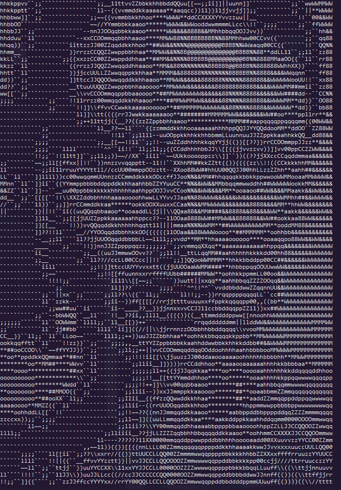
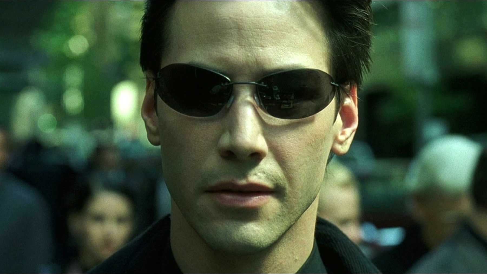

# ascii-gen-js
A small tool for converting images into ASCII. It uses the [sharp](https://github.com/lovell/sharp) image processing library for resizing, colour manipulation, and converting the image into a buffer.

I find that it works best if you use a black and white image, but feel free to mess around with it! :fire:

Tested with node **v10**.


## Next steps
* Smoother experience
* Adding some splashes of colour
* It would be really cool if I can use that to stream videos through your webcam properly... ASCII videos!

## ascii-cli-cam
Try it out through your webcam! I'm still working on making the code more performant and streamable so you can get closer to a smooth video experience.

### Dependencies

Since this tool uses `node-webcam` to interact with the webcam, you'll need to install its dependency, based on your OS.

#### Linux

```
#Linux relies on fswebcam currently
#Tested on ubuntu

sudo apt-get install fswebcam
```

#### Mac OSX

```
#Mac OSX relies on imagesnap
#Repo https://github.com/rharder/imagesnap
#Avaliable through brew

brew install imagesnap
```

#### Windows
Lucky you, no installation required!

### Usage

```
node src/ascii-cli-cam.js [-i | --invert] [-t | --type <avg|lightness|luminocity>]
```

## ascii-cli
Useful for trying out the tool through your terminal :smile:

There are some images in the `/res` folder that you can try out.

The tool will try to fit the image within the bounds of your terminal without stretching the image, so give yourself more terminal space if it looks really small.

### Arguments
* `filename`
* `-i` `--invert`: `Boolean` *[optional]* inverts the brightness of the image
* `-t` `--type`: `String<'avg', 'lightness', 'luminocity'>` *[optional]* changes the type of brightness mapping, default is `avg`.

### Usage
```bash
node src/ascii-cli.js <path-to-img> [-i | --invert] [-t | --type <avg|lightness|luminocity>]
```

### Samples

Image                   |  ASCII
:----------------------:|:-------------------------:
  |  


With a smaller font, you'll get more detail:

Image                   |  ASCII
:----------------------:|:-------------------------:
  |  


## References
Credits to [Robert Heaton](https://robertheaton.com/), who runs a blog about programming cool projects that inspired this one.
