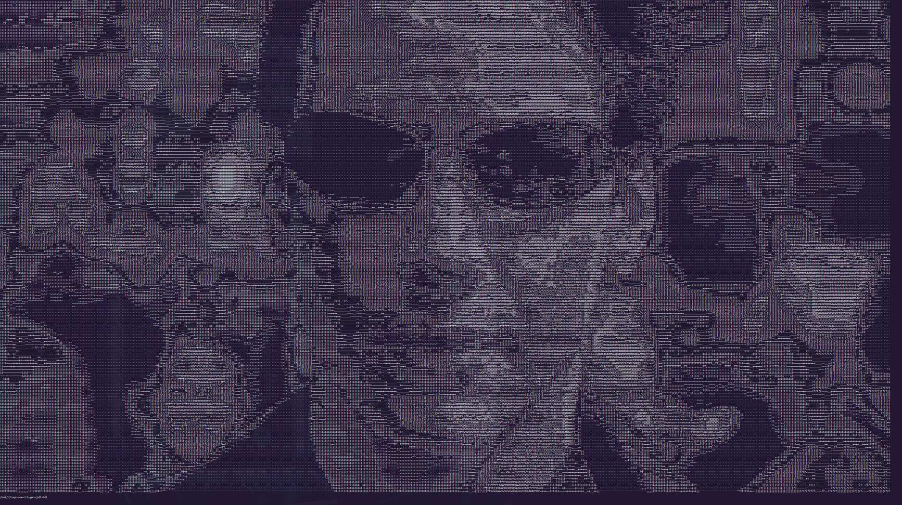

# ascii-gen-js
A small tool for converting images into ASCII. It uses the [sharp](https://github.com/lovell/sharp) image processing library for resizing, colour manipulation, and converting the image into a buffer.

I find that it works best if you use a black and white image, but feel free to mess around with it! :fire:

## Next steps
* I'll enable the program to read images through your webcam, so you can take cool selfies :raised_hands:
* It'd be really cool if I can use that to stream videos through your webcam... ASCII videos!

## ascii-cli
Useful for trying out the tool through your terminal :smile:

There are some images in the `/res` folder that you can try out.

The tool will try to fit the image within the bounds of your terminal without stretching the image, so give yourself more terminal space if it looks really small.

### Arguments
* `filename`
* `-i` `--invert`: `Boolean` *[optional]* inverts the brightness of the image
* `-t` `--type`: `String<'avg', 'lightness', 'luminocity'>` *[optional]* changes the type of brightness mapping, default is `avg`.

### Usage
```bash
node src/ascii-cli.js -i -t avg path_to_img.png
```

### Samples

Image                   |  ASCII
:----------------------:|:-------------------------:
  |  


With a smaller font, you'll get more detail:

Image                   |  ASCII
:----------------------:|:-------------------------:
  |  


## References
Credits to [Robert Heaton](https://robertheaton.com/), who runs a blog about programming cool projects that inspired this one.
